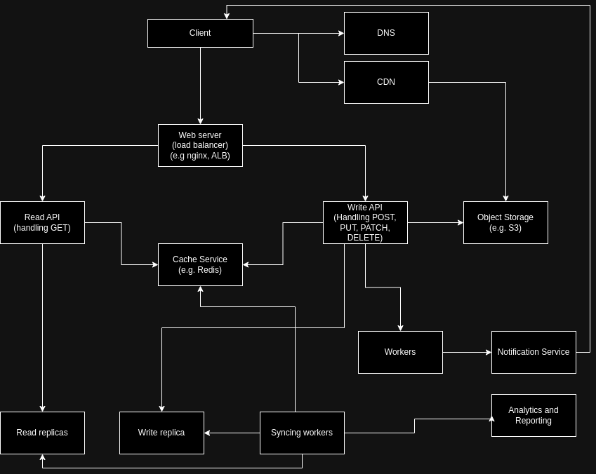

# projector-instagram-design
Homework 6 for projector course.

# Step 1: Outline use cases and constraints
> Gather requirements and scope the problem. Ask questions to clarify use cases and constraints. Discuss assumptions.
1. We analyse just news feed that contains video and photos.
2. We interested only in likes and comments functionality.

## Use cases
### We'll scope the problem to handle only the following use cases:
1. User opens the main page and the feed is visible:
    1. User sees the number of likes for a specific post
    2. User sees the number of comments for a specific post
    3. User sees the content of a specific post
2. User opens the list of people who liked the post
3. User opens the list of comments for a specific post
4. User clicks 'Like' button/image on a specific post
5. User sends a comment for a specific post
6. User receives a notification for likes and comments

## Constraints and assumptions
### State assumptions
1. 2 billion monthly active users
2. Service has high availability
3. Some users have enormous number of subscribers, thus their posts are fan out to millions of users
4. Video cannot be longer than 60 seconds and should not be bigger than 100 MB
5. Photo cannot be bigger than 5 MB
6. One post may contain up to 9 media
7. We will not give an ability to have threads in comments. It is a flat link type
8. We do not give an ability to update the comment
9. We do not give an ability to like the comment
10. We do not give an ability to remove the comments

### Out of scope
1. User posts photos and videos
2. User settings on restrictions for viewing/commenting/liking

## Calculate usage
### RPS
1. 50.000 feed requests per second
2. 50.000 likes per second
3. 10.000 comments per second

## Storage/data size
### Models in db
#### Post
```
post_id: uuid/String - 16 bytes (not an incremental int/bigine as it restricts with strict order of the records)
user_id: uuid/String - 16 bytes
caption: String - 1024 bytes
media_links: String[9] - 255 bytes * 9 = 255 - 2295 bytes
media_type: Int - 4 bytes
created_at: timestamp/String - 16 bytes
updated_at: timestamp/String - 16 bytes
likes: {
    count: Int - 4 bytes
    users: uuid[] - 16 bytes * count
}
comments: {
    id: uuid/String - 16 bytes
    user_id: uuid/String - 16 bytes
    text: String - 255 bytes
    created_at: timestamp/String - 16 bytes
}[]
```
### Models on response
Obviously, we will be giving slight different model for users on a response (like user_id is converted to a differnt model)
#### user_id converstion on response
```
user_id -> userOnResponse
{
  user_id: uuid/String - 16 bytes
  username: String - 32 bytes
  photo_link: String - 255 bytes
}
```
Also, the list of comments and the list of people who liked the post will be paginated:
```
likesOnResponse
{
    entities: userOnResponse[]
    page: Int - 4 bytes
    pageSize: Int - 4 bytes
}
```
#### comments
Same for the comments:
```
commentOnResponse
{
    id: uuid/String - 16 bytes
    user: userOnResponse
    text: String - 255 bytes
    created_at: timestamp/String - 16 bytes
}
```
```
comments:
{
    entities: commentOnResponse[]
    page: Int - 4 bytes
    pageSize: Int - 4 bytes
}
```

#### post
So the final post for the user would look like
```
postOnResponse
{
    post_id: uuid/String
    user: userOnResponse
    caption: String
    media_links: String[9]
    media_type: String
    created_at: timestamp/String
    updated_at: timestamp/String
    likes: {
        count: Int
        last_friend_like: userOnResponse
    }
    comments: {
        count: Int
        last_comment: {
            id: uuid/String
            user: userOnResponse
            text: String
            created_at: timestamp/String
        }   
    }
}
```

# Step 2: Create a high level design
> Outline a high level design with all important components

## REST API
### Get feed
```
Request:
GET ${host}/feed?page=1&pageSize=10

Response:
{
    entities: postOnResponse[] 
    page: Int
    pageSize: Int
}
```
page and pageSize could be ommited for the first request and set by default on the backend side
### Get comments
```
Request:
GET ${host}/posts/{id}/comments?page=1&pageSize=100

Response:
{
    entities: commentOnResponse[] 
    page: Int
    pageSize: Int
}
```
### Get likes
```
Request:
GET ${host}/posts/{id}/likes?page=1&pageSize=100

Response:
{
    entities: likesOnResponse[] 
    page: Int
    pageSize: Int
}
```
### Post Like
```
Request:
POST ${host}/posts/{id}/likes

Request: {
    isLike: true
} <- post id is retrieved from path and user is retrieved from session
Response: 200
```
### Remove Like
```
Request:
POST ${host}/posts/{id}/likes

Request: {
    isLike: false
} <- post id is retrieved from path and user is retrieved from session
Response: 200
```
### Post Comment
```
Request:
POST ${host}/posts/{id}/comments

Request: {
    text: String
} <- post id is retrieved from path and user is retrieved from session
Response: 200
```

## Design schema
### Schema


### Setup
1. DNS
2. CDN
3. Web servcer - load balancer
4. Read API
5. Write API
6. Cache Service
7. Read replicas of DB
8. Write replicas of DB
9. Object store - for media files
10. Notification Service
11. Analytics and Reporting Service
12. Workers for notification service (and potentially for a different functionality out of the scope)
13. Workers for syncronizing the data between cache and DB in batches

### Explanation
There is an important notice that every service will be scaled to have many instances depending on the load.
Also, we could play around with database settings and choice. Some specific solutions like Cassandra may be applied.

## Data flow
### Get feed
1. Client performs a request
2. Load balancer sends it to the most appropriate READ API service
3. Read API goes to Read DB replicate to retrieve the last posts for the user and the respective entities (comments and likes)
4. The response is returned to the client
5. The client makes a request to get media from Object Store

### Post like
1. Client performs a request
2. Load balancer sends it to the most appropriate WRITE API service
3. Write API writes the data to cache service by incrising a counter and pushing userId
4. Write API sends an event to worker, that will push an event to notification service so it will create a push notification to the client.

### Remove like
1. Client performs a request
2. Load balancer sends it to the most appropriate WRITE API service
3. Write API writes the data to cache service by decrising a counter and pushing userId

### Get likes
1. Client performs a request
2. Load balancer sends it to the most appropriate READ API service
3. READ API goes to cache service. 
4. If there is no information it goes to read replica

### Get comments
1. Client performs a request
2. Load balancer sends it to the most appropriate READ API service
3. READ API goes to cache service. 
4. If there is no information it goes to read replica

### Post comments
1. Client performs a request
2. Load balancer sends it to the most appropriate WRITE API service
3. Write API goes to write replica
4. Write API sends an event to worker, that will push an event to notification service so it will create a push notification to the client. Also, 

### Workers
The system would have two types of workers: to make calls to notification service and to syncronize data from cache to write db in batches istead of recording every single like one by one. And these workers would grab the data from read replicas to push the data to analytics and reporting service. 

# Step 3: Analysing bottlenecks and SPOFs
## Bottlenecks:
1. Object Storage. All the high volume information will be recorded and taken from there, that makes huge load on that part of the system. The network bandwidth and speed should be the highest.
2. Cache Service. The amount of data it should be able to handle in RAM is enormous. There should be a reliable scaling strategy implemented.
3. Database. The replica sets should bring us an advantage. However, I'm pretty sure the common solution for mongoDb or PostreSQL will not work on that scale. Thus, there must be a custom solution and a specific choise like Cassandra or something. But I'm convienced that we cannot predict such details at the beginning and many companies find the working and appropriate solution after the organic evolution and tests on different setups.

## Single point of failure:
Literally each part of the system could fail, but the most important ones are:
1. Read API - as users will not be able to even see the content.
2. Write API - as users will not be able to interact with the content. However, it's not that critical as the read one.
3. Object Storage - as it contains all the media data to display

On the other hand, all of the services are replicated and should not be down at the same time.
But again, the system is built that way, some parts could work independently.
1. The system will be working without cache, but it will take much more time to fetch the information from db istead. That brings more load there.
2. The system will be working without notification service. No pushes making user experience worse, but not critical.
3. The user doesn't care about analytics. It is for own usage.
4. Syncing workers failure is the reason, why some data will not be up to date, but it is not a crucial problem IMHO.